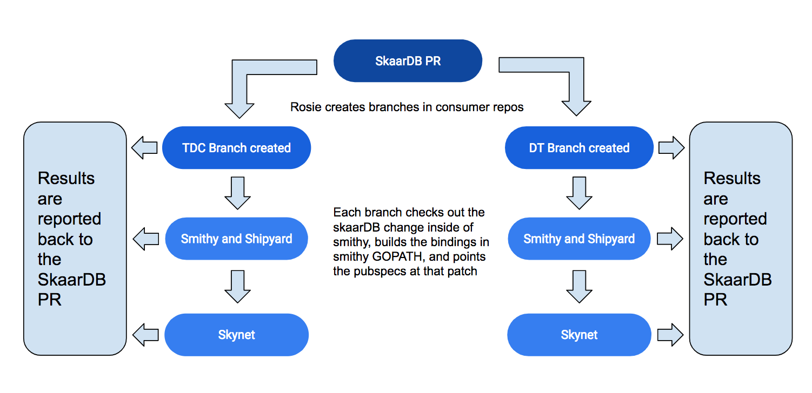
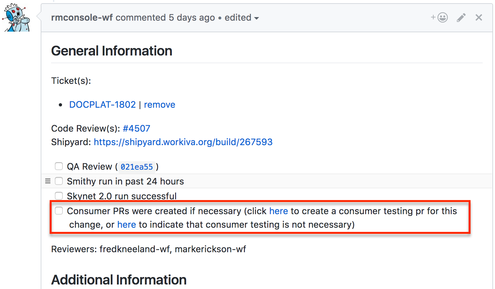
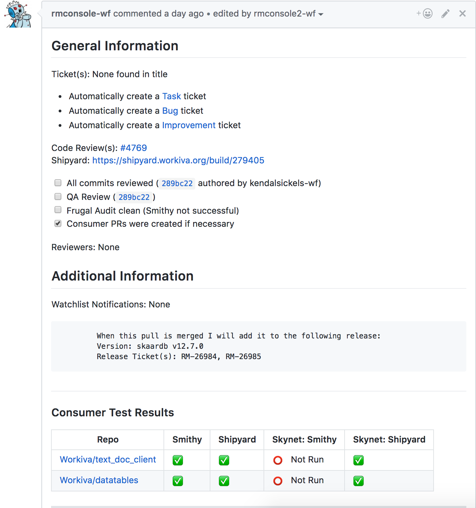
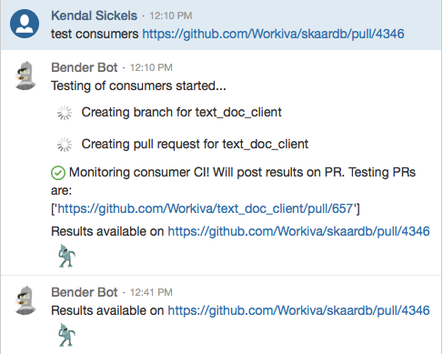
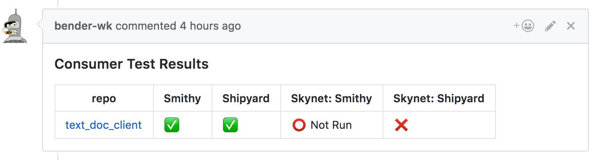

Consumer Testing
================

## Why is this important?
Consumer Testing verifies that changes made to the skaardb bindings functions properly with the Production skaardb container and the master versions of its consumers (text_doc_client and datatables).

## How does it work?
This is accomplished by checking out the skaardb change in smithy and running the skaardb build scripts. The pubspec is then modified to point the client at that version of skaardb and running the full CI process. Finally, the results of each step in that process is reported to the originating skaardb PR.

## When is it necessary?
When making a change that impacts Clients which consume skaardb (text_doc_client or datatables), it is required that you run consumer testing.

Examples of areas that, when modified, require consumer testing be run:
 - [Client directory](https://github.com/Workiva/skaardb/tree/master/cds/client)
 - [Shared directory](https://github.com/Workiva/skaardb/tree/master/cds/shared)
 - [Common directory](https://github.com/Workiva/skaardb/tree/master/common)
 - [Lib](https://github.com/Workiva/skaardb/tree/master/lib)
 
## How do I run it?

#### via RMConsole

In the rosie comment on each PR you will see the option below:

1. If your change in any way impacts consumers, select the first link to create a consumer testing PR
2. If you're unsure what your change will fully impact, select the first link and use the time waiting for results to search for the answer to that question.
3. If your change is outside of that scope, select the second link to indicate consumer testing is not necessary (this will meet the merge requirement but you will be judged if you are incorrect).

When consumer testing is complete, the comment will update to look similar to below:

*Note: "Skynet: Smithy" is not currently run in text_doc_client or datatables

#### via Bender

Running the below commands will create a branch in text_doc_client off of master and report the results of the build process on that 
branch to the skaardb PR you are testing.

1. Open a hipchat conversation with bender
2. Type 'test consumers <pull_request> close <optional_command>'
3. Verify consumer testing results are as expected

When consumer testing is complete, a comment will appear similar to below:

*Note: "Skynet: Smithy" is not currently run in text_doc_client

Or, even easier, install [Bendium - Chrome Web Store](https://chrome.google.com/webstore/detail/bendium/fldgcmpjddlngopfljnnahojdcbkpchp) and just click "Test Consumers" while on the PR page!

#### FAQ

Q. I ran consumer testing and it found an issue.  How do I rerun consumer testing when the issue is fixed?

A. If you are consumer testing via RMConsole, that is done automatically via Rosie rebuilding smithy on open consumer PRs. If you are using Bender, you currently need to delete your previous consumer branch and create a new one.

---

Q. How can I verify what commit consumer testing is running against?

A. You can open the smithy build on the consumer branch and find that information in the "before_script" portion on a datatables branch and the "script.2" portion on a text_doc_client branch.

---

Q. Are my consumer branches closed for me?

A. Rosie "should" do this but [RMCONS-8244](https://jira.atl.workiva.net/browse/RMCONS-8244) has been created to track it intermittently not working. If using Bender, just add the "close" optional command. If you're using the Bendium extension, check the "close" checkbox.

---

Q. Who do I reach out to if I have questions about consumer testing?

A. Charlie Kump or Kendal Sickels would be excellent options.  If neither of those individuals are available then @qa in the Topic: DPnE Dev Support (Docs, Pres, Spreadsheets) chat.
